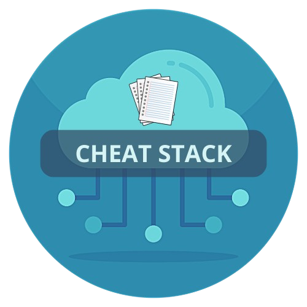

# CheatStack

If CheatStack helps you, consider giving us a ⭐ on **[GitHub](https://github.com/ArpitStack/cheat-stack)**! Your support encourages future development and helps others discover this tool!

**CheatStack** is a comprehensive cheatsheet tool for developers and DevOps professionals. It provides quick access to handy commands and tips for Git, Docker, Kubernetes, Cloud platforms, and more, all in one place. With CheatStack, you can speed up your workflow by referencing frequently used commands without having to search for them.

## 🚀 Features

1. 🧑‍💻 **Pre-built Command Collection**
   - A curated list of the most commonly used commands for DevOps, Git, Kubernetes, Docker, AWS, Azure, GCP, and more.

2. ⚡ **Searchable Cheatsheets**  
   - Quickly find commands for any topic through a searchable interface, making it easy to look up exactly what you need without wasting time.

3. 📄 **Custom Command Adding**
   - Add your own frequently used commands to the cheatsheet. Customize it to your workflow.

4. 🧑‍🔧 **Interactive Command Guide**
   - Get detailed descriptions and examples for each command to understand how to use it effectively in different scenarios.

5. 🔧 **Categorized Sections**
   - Commands are organized into categories like Git, Docker, Cloud, Kubernetes, etc., so you can navigate the cheatsheets easily.

6. 📚 **Markdown Support**  
   - Cheatsheets are written in markdown format, making it easy to contribute, extend, or customize them.

7. ⏱️ **Quick Access to Commands**
   - Save commands to your personal "Favorites" list for even quicker access.